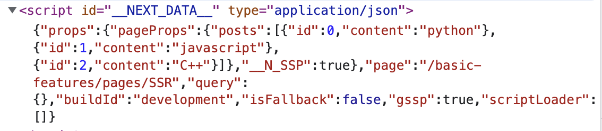

# [getServerSideProps](https://nextjs.org/docs/basic-features/data-fetching/get-server-side-props)

Next.js의 데이터 패칭을 통한 렌더링 방식은 크게 3가지입니다. (물론 CSR도 가능합니다 ㅎㅎ..)

1. SSR(Server-side Rendering) : Run time
2. SSG(Static-site Generation) : Build time
3. ISR(Incremental Static Regeneration) : Build time(SSG와 달리, 특정 주기마다 갱신할 수 있음)

## [getServerSideProps](https://nextjs.org/docs/basic-features/data-fetching/get-server-side-props)

> ❗️ `getServerSideProps`을 통해 전달되는 `props`는 초기 pre-rendering되는 HTML에 포함됩니다. 그래서 보안상으로 민감한 정보는 props로 전달하는걸 지양해야 합니다.

```tsx
export async function getServerSideProps(context) {
  return {
    props: {}, // will be passed to the page component as props
  };
}
```

|                       View                       |                     HTML Code                     |
| :----------------------------------------------: | :-----------------------------------------------: |
|  |  |

### 언제 getServerSideProps이 실행되나요?

- `getServerSideProps`은 오직 서버에서만 실행되는 함수입니다. (절대 클라이언트에서 실행되지 않습니다.)
- `getServerSideProps`가 실행되는 경우는 2가지입니다.
  - 사용자가 브라우저에서 엔드포인트를 바로 접근한 경우 => `getServerSideProps` 실행 후 프리-렌더링 된 결과랑 같이 반환
  - 사용자가 `next/link`를 통해 엔드포인트를 접근한 경우 => Next.js가 서버에게 API 요청 => `getServerSideProps` 실행

### 언제 getServerSideProps을 사용해야 하나요?

- 데이터 패칭이 요청 시점에 일어나야만 하는 경우
  - 예로, 토큰 기반의 인증 시, 매 요청마다 유효시간 검증을 위해!
- 참고
  - `cache-control` 헤더를 통해 `getServerSideProps을`의 결과를 캐싱할 수 있음
  - 최초에 서버가 페이지 렌더링에 필요한 데이터가 아니라면, 클라이언트 사이드에서 데이터를 패칭하거나 `getStaticProps`을 사용해도 됨

### 클라이언트-사이드에서 데이터 패칭

- 패칭되는 데이터의 갱신(변경) 주기가 잦다면, 굳이 프리-렌더링 과정에서 데이터를 패칭 과정을 포함시킬 필요가 없음
- 클라이언트-사이드에서 데이터를 패칭하기 때문에 SEO를 걱정할 수 있지만, 자주 변경되는 데이터는 SEO와 큰 관련이 없음

### getServerSideProps 과정에서 에러가 발생하면 어떻게 되나요?

- `pages/500.ts`로 리다이렉트됩니다

### Example

**Without caching**

```tsx
function Page({data}) {
  // Render data...
}

// This gets called on every request
export async function getServerSideProps() {
  // Fetch data from external API
  const res = await fetch(`https://.../data`);
  const data = await res.json();

  // Pass data to the page via props
  return {props: {data}};
}

export default Page;
```

**With caching**

```tsx
export async function getServerSideProps({req, res}) {
  res.setHeader(
    'Cache-Control',
    'public, s-maxage=10, stale-while-revalidate=59',
  );

  return {
    props: {},
  };
}
```
